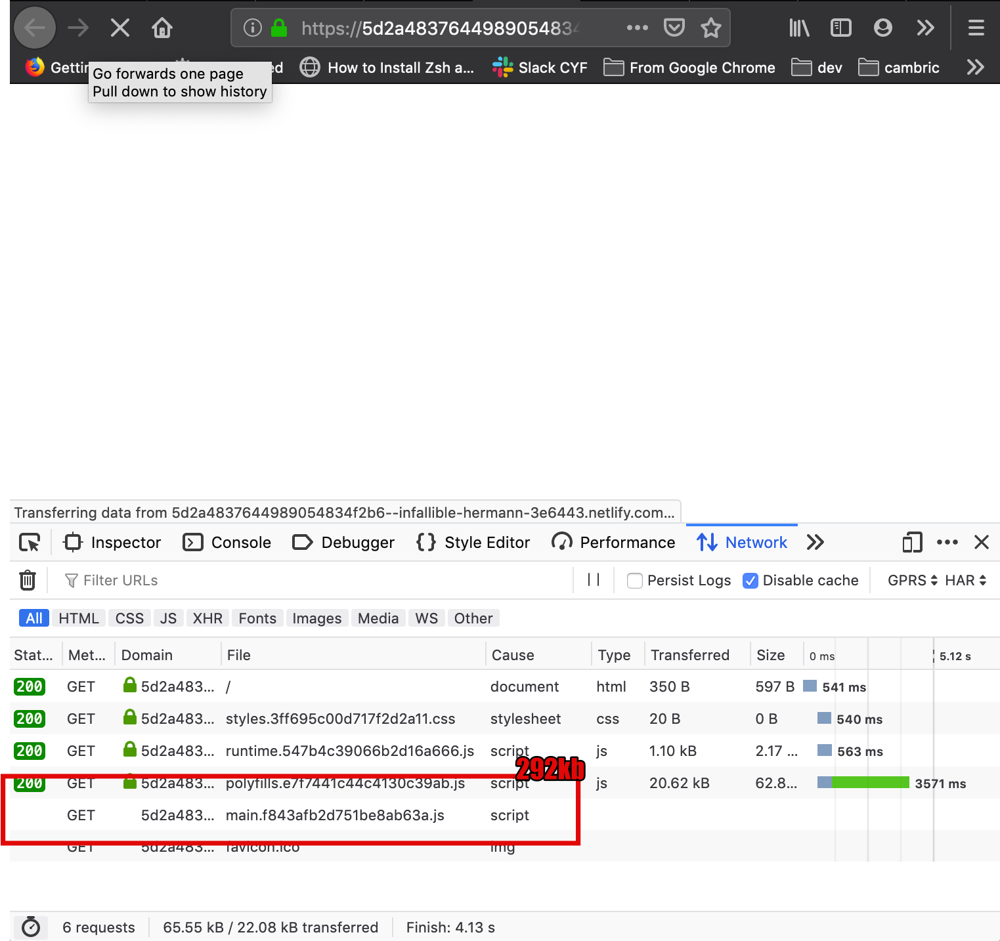
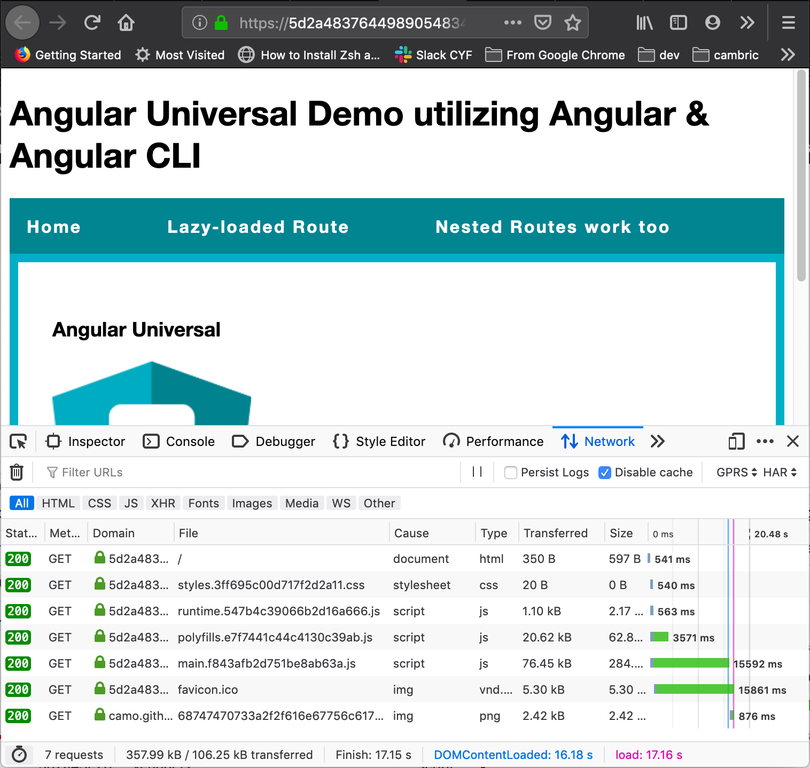

Using Gatsby and Netlify for the first time got me thinking. Sure, Gatsby + Netlify give you a super fast site - but why is it so fast?

What does "static" mean in static site generator? Gatsby uses React - a framework which I've seen used to build some pretty "dynamic" things. What's stopping me from adding a chat widget onto my static Gatsby site - would that break the world?

So here's my journey down that rabbit hole..and with it, the first light bulb moment:

> Static websites are sites not generated on the server

So this is a static site:

```html
<!DOCTYPE html>
<html lang="en">
  <head>
    <title>Hello world</title>
  </head>
  <body>
    Hello world!
  </body>
</html>
```

What else? Well, when you generate a new `create-react-app` ..app..and you build it - that's also a perfectly static app.

So framework sites are static? What's NOT a static site then?

Well, anytime you have **a server generating new html/JS/CSS files for each request** - that's **not** a static site. WordPress is not static - anytime you load a WordPress site, an APACHE server listens for your request, goes to some database to get the data, and calls upon PHP to generate you the final HTML file with the data neatly rendered before it finally hands it down to the browser.

## What about Angular Universal? Or Next.js?

I actually thought that these were the ways to make an Angular/React app static. 

Turns out it's the opposite - using any kind of server rendering (i.e. rendering your app on the server instead of the client), makes it dynamic! That's because **for every route you access, a new request is made to the server that returns you the pre-generated html for that route.**

To be clear: I'm not saying that static is better than dynamic. And I also won't go into the pros/cons of SSR (but you can read about it [here](https://dev.to/stereobooster/server-side-rendering-or-ssr-what-is-it-for-and-when-to-use-it-2cpg)) I'm just sharing my surprise that - turning your app from this logic intensive powerhouse that knows how to render and compile components and manipulate your DOM at runtime - into a simple, dumb, single HTML file **means you're not dealing with a static website anymore.**

But if Angular Universal and Next.js can go through your app and generate plain HTML...Why do we need a server to re-generate the page every time? 

Can't we just...

### Pre-render Angular/React apps

Turns out both do have options for pre-rendering all of your pages - thus eliminating the need for a server.

To explore this setting for Angular Universal - I used this project: https://github.com/angular/universal-starter

All the authors do to eliminate the need for a server to render your files: they just call `renderModuleFactory` (the function the server would call anytime you access a route) for each route in your app at...**build time!** ([line 36](https://github.com/angular/universal-starter/blob/master/prerender.ts#L36) in `prerender.ts` )

So let's take this live Angular app: [https://infallible-hermann-3e6443.netlify.com](https://infallible-hermann-3e6443.netlify.com/)

Really simple - but still, if you throttle the connection to GPRS (I used Firefox for this), it takes a full **26 seconds** to display something on the screen!

First thing when it loads...



Then after 26 seconds..



If you look at the screenshots above - it needs to wait for the 292kb download of "main.js", parse it, and execute it - very expensive operations! (when you're on a slow connection)

---

Now let's take the same app, but run it through our "pre-renderer": https://wonderful-haibt-5457d3.netlify.com/

If we do the same test again with GPRS network throttling - we almost instantly see something on the screen! Even though "main.js" is far from downloaded!


So to re-cap some terms used in the example above:

- both examples above are *static* sites - they don't need a server! Hence why they work on Netlify! (more on Netlify later)
- the difference is that one is pre-rendered at build time, while the other compiles in the browser

##What about GatsbyJS?

If it's so easy to keep an Angular app static, and we can even pre-render it, so we just deal with simple HTML - what does Gatsby bring?

Well, apart from a great user experience, an amazing ecosystem of plugins and themes and superb docs, and other performance improvements I'm not gonna go into - **Gatsby injects all your data at build time!!** 

I.e. Going back to my Wordpress example above - instead of using a server to query the DB for any new posts on a blog everytime somebody visits your site, Gatsby retrieves all of those posts at **build time**, and includes them in your generated site. You can then use a service like Netlify to serve your whole blog (posts and any other data included) directly from a CDN - without ever needing to go through a server or DB.

Again, I'm not arguing Gatsby is better than other options. My overly excited tone is meant to replicate the "eureka" moments I kept having when connecting the dots in this web of buzzwords.

##Netlify/JAMStack

I kind of snuck in a sentence above without fully explaining what I meant: *"if you can host on Netlify, then it proves it's static"* - well that's because Netlify is a purely static host. It does not know how to respond to HTTP requests and it won't run any processes for your site - it just knows how to give you files. And because it just serves files, it can put them directly on a CDN.

See this amazing presentation on the JAMStack from [Phil Hawksworth](https://twitter.com/philhawksworth) for answers to all of the questions you probably have now: https://vimeo.com/340526374

##APIs

Another thing worth mentioning is that it's perfectly fine for a static site to call APIs. You can still serve assets statically - and there's nothing stopping the served JS from making some HTTP request. That's why Netlify launched its companion [Functions](https://www.netlify.com/products/functions/) product.

##Conclusion

I find Gatsby and the JAMStack extremelly interesting. Not just because of how easy they make the life of a front-end developer - but also because of the ideas they promote for a much faster web and how they separate your stacks so explicitly. I strongly recommend you read more about what each of them brings to the table - as they might change how you think about deploying apps!
