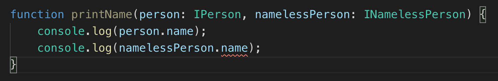

Let's extend an interface in TypeScript:

```typescript
interface IPerson {
    name: string;
    age: number;
}

interface IDeveloper extends IPerson {
    githubUrl: string;
    is10x: boolean;
}

function buildDevIntro(developer: IDeveloper) {
    return `Hi, I'm ${developer.name} 
            and my GitHub is ${developer.githubUrl}`;
}
```

As you can see, extension is a really useful way to re-use more general types (like a "person") and make them more specific: `IDeveloper`. 

Anything that's of type `IDeveloper` has all the properties we've declared for a developer, like `githubUrl` and whether they're a **10X developer**, but they also have all the properties of a person (`name` and `age`).

That's why TS lets us print out the developer's name in the code above without any errors.

But what if, instead of **adding** properties to a type via extension we want to..

## "Un-extend" an interface

I.e. Can we extend an existing type, but instead of specifying which properties we want to add, can we specify which ones we want to **remove?**

```typescript
interface INamelessPerson extends IPerson {
    -name: string; //can't we just use the minus sign on it?
}
```

Unfortunately, the above won't work :(

Not so unfortunately, this question has already been [answered on StackOverflow](https://stackoverflow.com/questions/51804810/how-to-remove-fields-from-a-typescript-interface-via-extension):


```typescript
//we define a new Omit type
type Omit<T, K extends keyof T> = Pick<T, Exclude<keyof T, K>>

//then we can use it
interface INamelessPerson extends Omit<IPerson, 'name'> {}
```

Now if we try it:



We get an error - great!

We can, of course, remove as many properties as we want:

```typescript
interface IEmptyPerson extends Omit<IPerson, 'name' | 'age'> {}
```

## But how does that work?

### Exclude

`Exclude` is a built-in type of TS, since version 2.8:

```typescript
type ProgrammingLanguages = 'JavaScript' | 'TypeScript' | 'Flow';
type NonTypedLanguages = Exclude<ProgrammingLanguages, 'TypeScript' | 'Flow'>;

//another way to write the above is..
type NonTypedLanguages = 'JavaScript';
```

It allows you, starting from a wider type, like the set of programming languages, to exclude a subset of types, like `'TypeScript' | 'Flow'`.

### Pick

```typescript
type INameable = Pick<IPerson, 'name'>;

//another way to write the above is..
type INameable = {
    name: string;
}
```

`Pick` is another built-in type of TS, and it allows you to build a subset of an existing type, by providing a list of just the property names you want to pick and transfer over to the new object:

### Omit

`Omit` is thankfully not another magic built-in type, but one we build ourselves:

```typescript
type Omit<T, K extends keyof T>
```

We're using the power of generics, to define an `Omit` type, that returns you a completely new type, based on 2 parameters you're sending it:
- a type `T`, which can be anything
- a type `K` which needs to be part of the set of all the keys of `T` - i.e. `keyof IPerson` returns the union type `name | age`. So `name`, `age`, `name | age` or `age | name` work perfectly well with our `Omit`

### Putting it all together

When we declare a type like this:

`type Omit<T, K extends keyof T>`

..and then use it: `Omit<IPerson, 'name'>`

> `T` will become `IPerson`

> `K` will become the string literal type `'name'`

..then we get all the keys of `IPerson`, and we use `Exclude` to generate ONLY they keys that we don't want to leave in there:

```typescript
Exclude<keyof IPerson, 'name'> // --> gives us the type 'age'
```

 Which in our case, leaves us with just `age`.

Now that we have the keys that we DO want in there, it's just a matter of using `Pick` against the original type, to pick just those properties that we need:

```typescript
Pick<IPerson, 'age'>
```

 gives us the type: `{ age: number }`.


